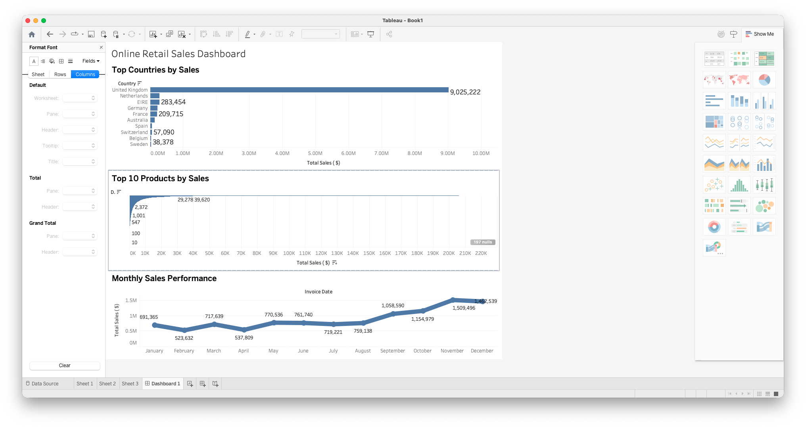

# Online Retail Sales Analysis

This project focuses on analyzing an online retail dataset to understand sales performance, customer trends, and product insights.

Instead of just creating charts, I worked on cleaning real-world messy data and then built visualizations to answer business questions.

---

## What I did

- Cleaned the dataset by removing missing customer records  
- Handled negative values (returns/cancellations) properly  
- Created a Revenue column using Quantity × Unit Price  
- Analyzed sales performance using Excel and Tableau  

---

## Key Insights

- United Kingdom contributed the majority of total sales  
- A small set of products generated most of the revenue  
- Sales activity in the dataset was concentrated in a specific time period  
- Returns were present in the data and were handled during analysis  

---

## Tools Used

- Microsoft Excel (Data Cleaning & Pivot Analysis)  
- Tableau Public (Dashboard & Visualization)  

---

## Dashboard Preview

---

## What I learned

This project helped me understand how real-world data is messy and requires cleaning before analysis.  
I also learned how to build dashboards that clearly communicate insights instead of just showing data.

---
